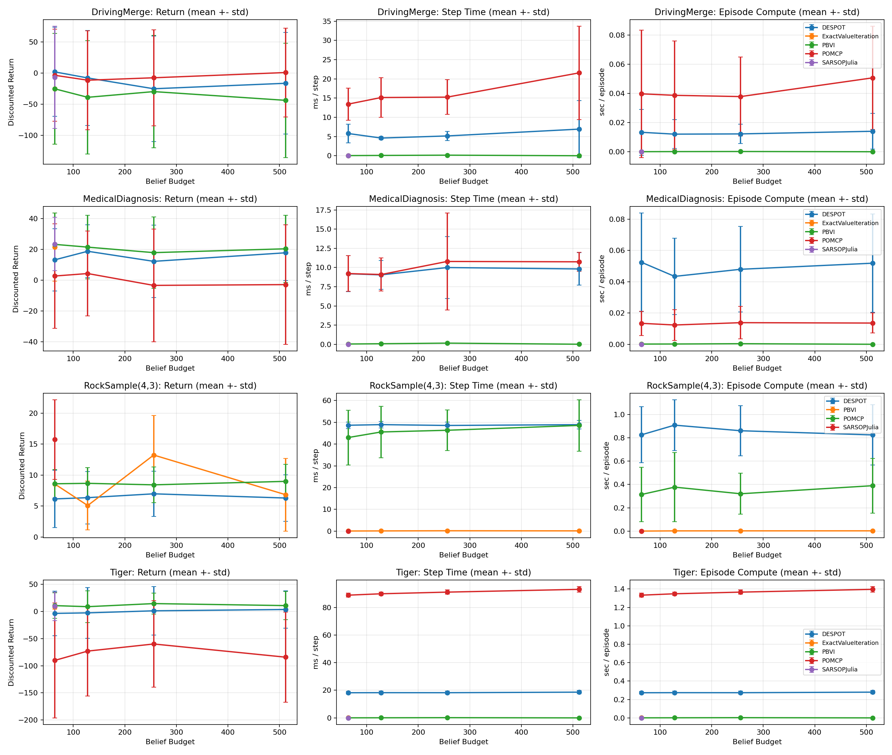
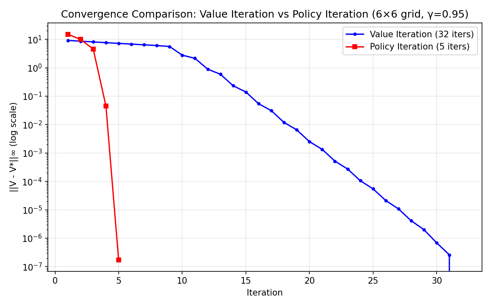
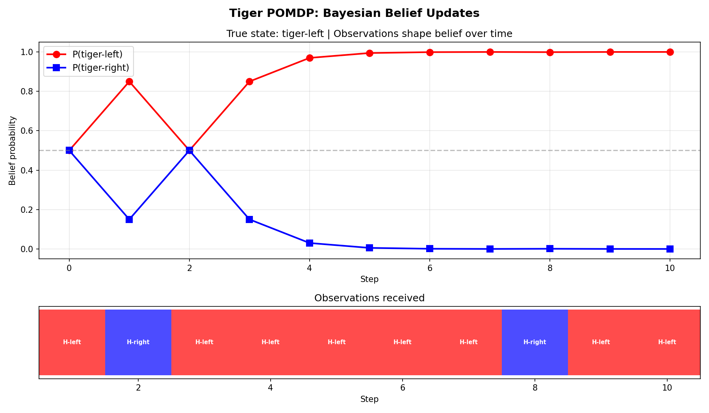
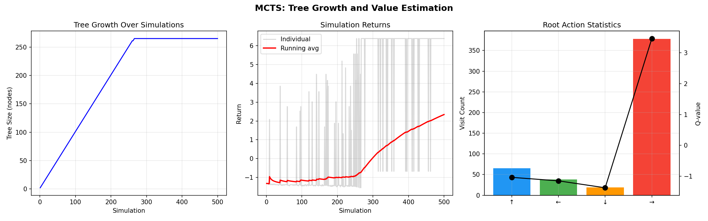
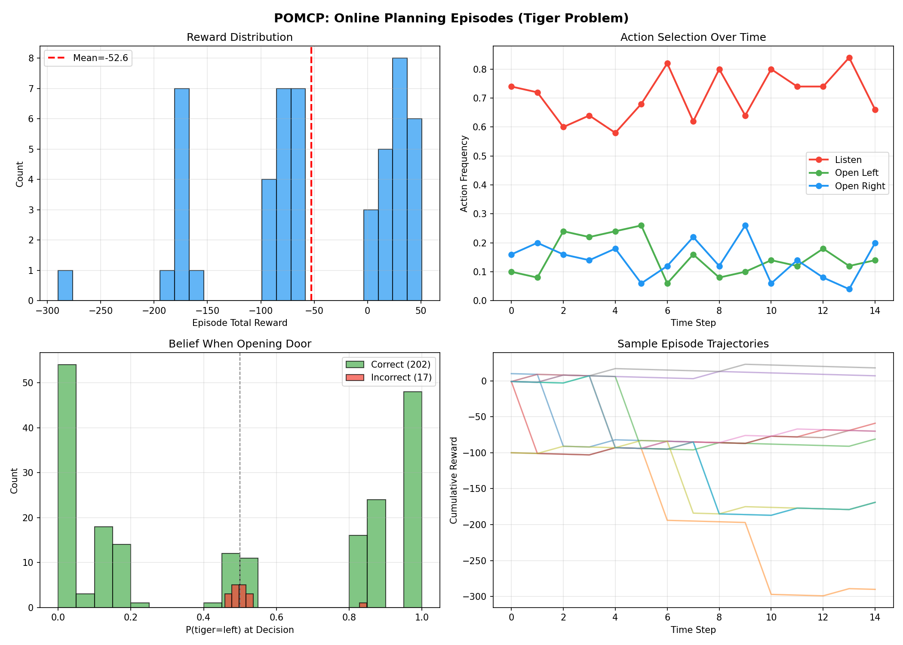
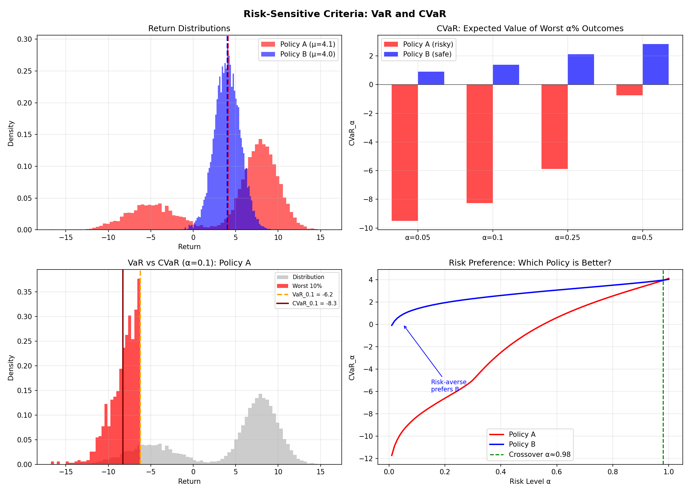
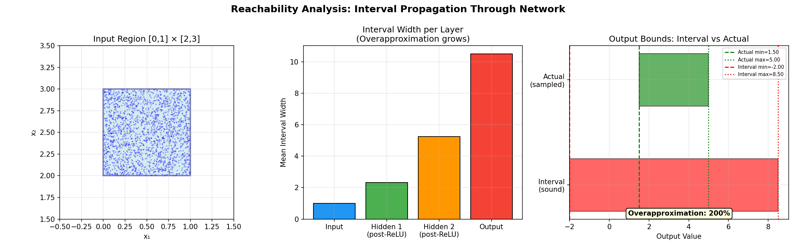

# Sequential Decision-Making


A practical portfolio of sequential decision-making projects, from MDP/POMDP fundamentals to safe RL, verification, and MPC.

The centerpiece is **Project 2: a reproducible POMDP solver benchmarking suite** that compares exact, point-based, and online simulation solvers on both standard and custom environments with scientifically useful metrics.

## Why This Repo Is Useful

- It is not just implementations, it includes comparative evaluation with reproducible outputs.
- It combines theory-grounded topics (DP, POMDP, MCTS) with practical engineering (benchmarking, plotting, reporting).
- It includes uncertainty-aware decision-making beyond toy examples (driving merge and medical diagnosis POMDPs).
- It spans the full course arc: planning, learning, safety, verification, and control.

## Project Index

| Project | Folder(s) | What You Get | Entry Point |
|---|---|---|---|
| Project 1: Planning + Belief Foundations | `mdp_dp/`, `pomdp/`, `pomcp/`, `mcts/` | Visual, executable intuition for Bellman updates, belief updates, alpha-vectors, UCT, and POMCP | `python3 pomdp/pomdp_visualization.py` |
| **Project 2: POMDP Solver Benchmarking (Flagship)** | `pomdp_benchmarks/` | Reproducible solver comparison with error bars, runtime, compute, and belief-divergence analysis | `python3 -m pomdp_benchmarks.run --quick` |
| Project 3: RL Extensions | `model_based_rl/`, `bayesian_rl/`, `depp_rl/` | Dyna-Q, Thompson sampling, tabular/deep Q-learning assignment code | `python3 model_based_rl/dyna_q_visualization.py` |
| Project 4: Safety + Verification | `safe_rl/`, `verification/`, `irl/` | CVaR/robust/constrained RL visuals, NN verification demos, IRL + verification/control tracks | `python3 safe_rl/safe_rl_visualization.py` |
| Project 5: Predictive Control | `mpc/` | Python/MATLAB MPC modules and report artifacts | `python3 mpc/Module_one.py` |

## Project 2: POMDP Solver Benchmarking Suite

A clean benchmarking harness for comparing solver behavior under partial observability and compute constraints.

### Solvers Covered

- Exact Value Iteration (tabular alpha-vector baseline)
- PBVI (point-based approximate offline planning)
- POMCP (online Monte Carlo tree search with particle belief)
- DESPOT-style sparse scenario online planner
- Optional AdaOPS-style adaptive online variant (`--include-adaops`)
- Optional BAS belief-adaptive search (`--include-bas`): a compute-allocation method that biases online search toward value-relevant belief-action regions, with handcrafted, distilled-neural, or learned-from-search priors
- Optional Julia SARSOP bridge (`--include-sarsop-julia`)

### Environments Covered

- `Tiger` (classic small benchmark)
- `RockSample(4,3)` (scalability and information gathering)
- `DrivingMerge` (custom uncertainty-aware merge decision)
- `MedicalDiagnosis` (custom sequential testing and stopping)
- Optional harder settings: `RockSample(5,4)` and `DrivingMergeNoisy` (`--include-harder-env`)

### Metrics (Scientific Reporting)

- Discounted return: `mean +- std` across episodes
- Runtime per step: `step_time_mean_ms +- step_time_std_ms`
- Total compute per episode: `episode_compute_mean_sec +- episode_compute_std_sec`
- Belief divergence: `mean +- std` Jensen-Shannon divergence (exact belief vs particle approximation, where applicable)

### Latest Full Benchmark Snapshot

Source artifacts:
- `pomdp_benchmarks/results/full/benchmark_summary.csv`
- `pomdp_benchmarks/results/full/benchmark_summary.json`
- `pomdp_benchmarks/results/full/scaling_curve.png`
- `pomdp_benchmarks/results/full/pareto_return_vs_compute.png`

Configuration used:
- `40` episodes per setting
- belief budgets `64,128,256,512`
- `56` environment/solver/budget combinations total
- `55` completed, `1` skipped (`ExactValueIteration` on `RockSample(4,3)` due to state cap)

Best mean discounted return by environment:

| Environment | Best Solver | Budget | Return (mean +- std) | Step Time (ms +- std) |
|---|---|---:|---:|---:|
| Tiger | PBVI | 256 | 14.6017 +- 19.3735 | 0.1516 +- 0.0074 |
| RockSample(4,3) | SARSOPJulia | 64 | 15.7502 +- 6.4212 | 0.0047 +- 0.0011 |
| DrivingMerge | DESPOT | 64 | 2.0021 +- 71.7724 | 5.7895 +- 2.4018 |
| MedicalDiagnosis | SARSOPJulia | 64 | 23.5413 +- 17.3202 | 0.0032 +- 0.0025 |

Scalability plot with error bars:



Return-vs-compute Pareto frontiers:


### Reproduce Project 2

Quick smoke run:

```bash
python3 -m pomdp_benchmarks.run --quick
```

Full run:

```bash
python3 -m pomdp_benchmarks.run \
  --episodes 40 \
  --belief-budgets 64,128,256,512 \
  --output-dir pomdp_benchmarks/results/full
```

Plot scaling curves from CSV:

```bash
python3 -m pomdp_benchmarks.plot_scaling \
  --csv pomdp_benchmarks/results/full/benchmark_summary.csv
```

Plot return-vs-compute Pareto frontiers:

```bash
python3 -m pomdp_benchmarks.plot_pareto \
  --csv pomdp_benchmarks/results/full/benchmark_summary.csv \
  --out pomdp_benchmarks/results/full/pareto_return_vs_compute.png
```

Extended stress run (AdaOPS + harder environments):

```bash
python3 -m pomdp_benchmarks.run \
  --episodes 40 \
  --belief-budgets 64,128,256,512 \
  --include-adaops \
  --include-harder-env
```

Extended stress run with the new compute-allocation method:

```bash
python3 -m pomdp_benchmarks.run \
  --episodes 40 \
  --belief-budgets 64,128,256,512 \
  --include-adaops \
  --include-bas \
  --include-harder-env
```

BAS ablation examples:

```bash
# Prior + rollout heuristic
python3 -m pomdp_benchmarks.run --quick --include-bas --bas-ablation both

# Prior only
python3 -m pomdp_benchmarks.run --quick --include-bas --bas-ablation root_only

# Rollout heuristic only
python3 -m pomdp_benchmarks.run --quick --include-bas --bas-ablation rollout_only

# Deep prior + rollout shaping with a neural policy prior
python3 -m pomdp_benchmarks.run --quick --include-bas --bas-ablation deep_rollout --bas-policy-model neural

# Train learned BAS checkpoints from search visit counts and returns
python3 -m pomdp_benchmarks.train_bas_model --quick --bas-ablation deep_rollout

# Stronger learned-BAS training with iterative data aggregation
python3 -m pomdp_benchmarks.train_bas_model --episodes 100 --belief-budget 128 --bas-ablation deep_rollout --aggregation-rounds 3

# Evaluate BAS with learned policy/value checkpoints
python3 -m pomdp_benchmarks.run --quick --include-bas --bas-ablation deep_rollout --bas-policy-model learned --bas-model-dir pomdp_benchmarks/learned_bas_models/checkpoints
```

### Optional Julia SARSOP Bridge

Install Julia dependencies:

```bash
julia -e 'using Pkg; Pkg.add(["POMDPs","POMDPTools","SARSOP","JSON3"])'
```

Include SARSOP in benchmark runs:

```bash
python3 -m pomdp_benchmarks.run --quick --include-sarsop-julia
```

If `julia` comes from `juliaup`, the benchmark now tries to resolve a concrete installed Julia binary automatically to avoid launcher lockfile issues in restricted environments. You can still override it explicitly with `--julia-bin /path/to/julia`.

If Julia is unavailable or fails, `SARSOPJulia` is marked `skipped` rather than crashing the full benchmark sweep.

Estimate how many episodes are needed to tighten CI95 widths:

```bash
python3 -m pomdp_benchmarks.ci_episode_plan \
  --summary pomdp_benchmarks/results/20260410-102420/benchmark_summary.json \
  --env DrivingMerge \
  --top-k 2
```

## Quick Start (Whole Repo)

### 1. Create an Environment

```bash
python3 -m venv .venv
source .venv/bin/activate
pip install numpy matplotlib scipy
```

### 2. Optional Extras

```bash
pip install cvxopt gym torch
```

- `cvxopt` is needed for `irl/main.py`
- `gym` and `torch` are used in `depp_rl/`

### 3. Run Core Visualizations

```bash
python3 mdp_dp/mdp_visualization.py
python3 pomdp/pomdp_visualization.py
python3 pomcp/pomcp_visualization.py
python3 -m pomdp_benchmarks.run --quick
python3 mcts/mcts_visualization.py
python3 model_based_rl/dyna_q_visualization.py
python3 bayesian_rl/bayesian_rl_visualization.py
python3 safe_rl/safe_rl_visualization.py
python3 verification/verification_visualization.py
```

All visualization scripts save figures directly in their module directory.

## Gallery

| MDP DP | POMDP Belief Updates | MCTS Phases |
|---|---|---|
|  |  |  |

| POMCP Online Planning | Safe RL (CVaR) | Verification Reachability |
|---|---|---|
|  |  |  |

## Notes By Subproject

- `depp_rl/`: assignment-style tabular/deep Q-learning code (some scripts target older Gym APIs).
- `irl/`: includes adapted inverse RL code with attribution details in `irl/README.md`, plus separate `SMT Solver/`, `NN Controllers/`, and `Neural Certificates/` tracks.
- `mpc/`: includes Python and MATLAB implementations (`Module_one/two/three`) and a report in `mpc/mpc_report.pdf`.

## Optional `uv` Usage

```bash
uv run --with numpy --with matplotlib python3 mdp_dp/mdp_visualization.py
uv run --with numpy --with matplotlib --with scipy python3 mpc/Module_two.py
uv run --with numpy --with matplotlib --with cvxopt python3 irl/main.py
```

## Attribution And Licensing

- `irl/` includes adapted inverse reinforcement learning code and its own attribution/license notes.
- Check local README/LICENSE files inside subfolders for module-specific licensing details.
